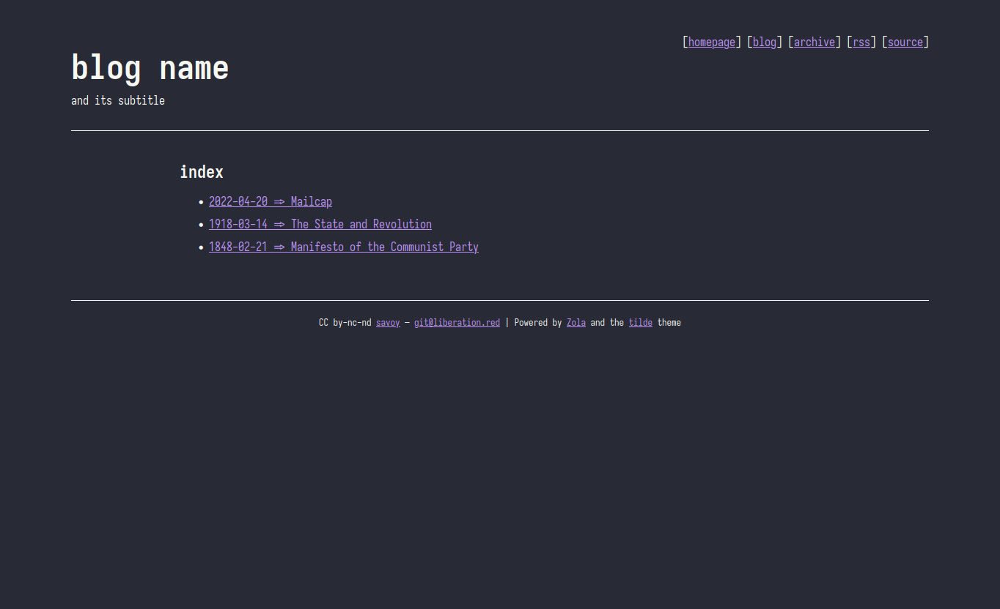
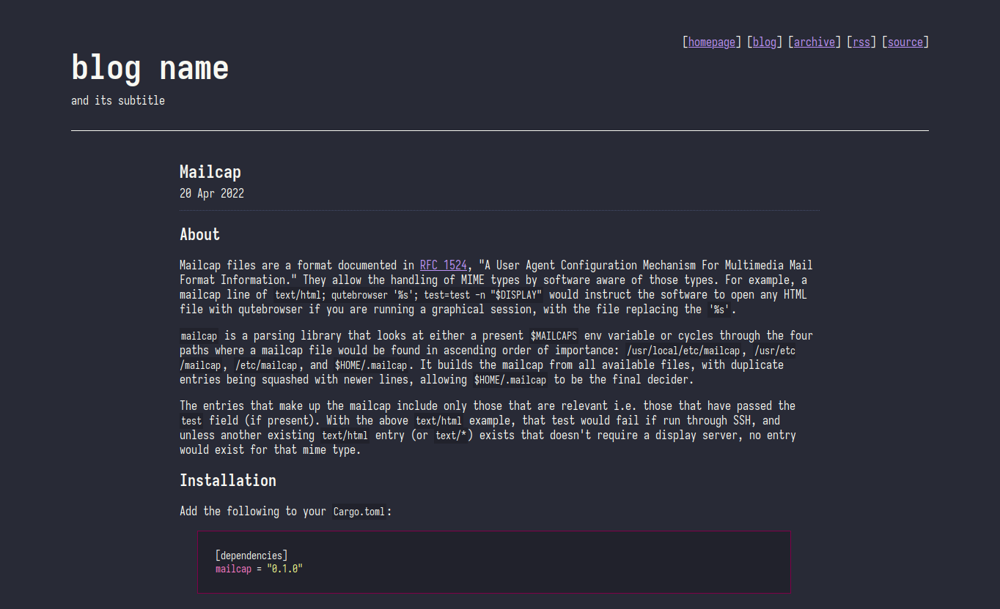

# tilde

Lightweight and minimal blog theme for the [Zola](https://www.getzola.org/)
static site generator.

Live demo is available here:
[https://savoy.srht.site/blog-demo](https://savoy.srht.site/blog-demo)





## Installation

[Theme documentation](https://www.getzola.org/documentation/themes/installing-and-using-themes/)

Clone this repository into your site's `themes` directory or add it as a
submodule:

```bash
# Clone into themes
$ git clone https://git.sr.ht/~savoy/tilde themes/tilde
# Add as a submodule
$ git submodule add https://git.sr.ht/~savoy/tilde themes/tilde
```

## Configuration

This theme offers the following config options:

```toml
[extra]

homepage = "" # author homepage
subtitle = "" # blog subtitle
git_source = "" # blog source code
author = "" # author name
email = "" # author email
license = "" # blog license
```
